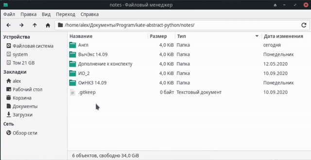
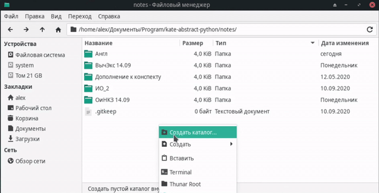
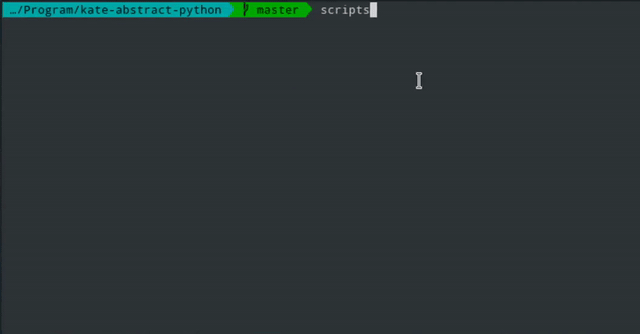
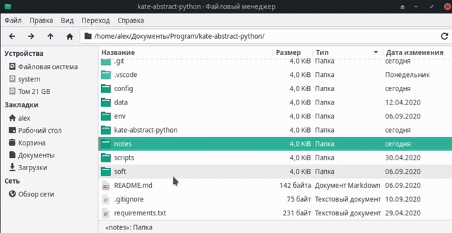

# kate-abstract-python

Создание **pdf** документа на основе **файлов изображений**. Программа может использоваться студентами для хранения фотографий лекций или других записей в удобном для чтения формате.

# Установка 

Для работы приложения необходимо следующее программное обеспечение:

- [Python](https://www.python.org/downloads/) версии 3.8.2 и выше;
- Установленные в системе шрифты [DejaVu fonts](https://github.com/dejavu-fonts/dejavu-fonts);
- Программа для конвертирования в **pdf** [Pandoc](https://pandoc.org/installing.html);
- Поддержка стилизации создаваемых **pdf** документов:
  - [Miktex](https://miktex.org/download) для Windows;
  - [TeX Live](https://wiki.archlinux.org/index.php/TeX_Live) для Linux.

После установки требуемого ПО необходимо в папке проекта создать виртуальное окружение:

```bash
  # Создание виртуального окружения
  $ python3 -m pip install --user virtualenv
  $ python3 -m venv env

  # Активация виртуального окружения
  $ source env/bin/activate
```

В созданном виртуальном окружении нужно установить необходимые пакеты, описанные в [requirements.txt](requirements.txt):

```bash  
  # Установка необходимых пакетов
  (env) $ pip install -r requirements.txt
```

При возникновении конфликта пакета PyQt5 из виртуального окружения с пакетом, имеющимся в системе, необходимо удалить пакет из виртуального окружения и заменить его ссылкой:

```bash  
  # Замена пакета PyQt5 на ссылку из системы
  $ PyQt5sys="/usr/lib/python3.8/site-packages/PyQt5"
  $ PyQt5env="env/lib/python3.8/site-packages/PyQt5"
  $ sudo rm -rf "$PyQt5env"
  $ ln -s "$PyQt5sys" "$PyQt5env"
```

На Linux для развертывания приложения можно воспользоваться bash-скриптом [scripts/install.sh](scripts/install.sh).

# Использование

После установки всего необходимого программа запускается из виртуального окружения:

```bash  
  # Установка необходимых пакетов
  (env) $ python3 kate-abstract-python
```
Программа сканирует папку [notes](notes/) на наличие папок конспектов. Папка конспекта, в свою очередь, разбивается на подпапки в зависимости от структуры генерируемого **pdf** документа. **Изображения** распределяются по папкам разделов. Если генерируемый файл не содержит разделов, все файлы изображений помещаются в папку с названием _Основной_ в папке конспекта.

Пример файловой структуры папок конспектов в [notes](notes/):
```
  notes/
  --> Конспект 1
    --> Основной
      --> Картинка 1
      --> Картинка 2
      --> Картинка 3
  --> Конспект 2
    --> Раздел 1
      --> Картинка 4
      --> Картинка 5
    --> Раздел 2
      --> Картинка 6
      --> Картинка 7
      --> Картинка 8
  ...
```
Создание папки конспекта в [notes](notes/):

<p align="center">
  
  
</p>

Для создания **pdf** документа конспекта нужно выбрать требуемую папку в списке и нажать _Создать_ (при необходимости список папок конспектов можно _Обновить_).  

<p align="center">
  
</p>

После этого открывается диалоговое окно настройки конспекта, в котором можно изменить порядок разделов, а также исключить не нужные разделы. Пользователь может выбрать, требуется ли ему создавать содержание в начале генерируемого **pdf** файла, а также имеется возможность выполнить сжатие документа с помощью сервиса [iLovePDF](https://www.ilovepdf.com/ru). Для работы с данным сервисом необходимо [зарегистрировать](https://developer.ilovepdf.com/signup) аккаунт разработчика и получить Secret Key. Данный ключ нужно записать в текстовый файл **config/ilovepdf**.

Сгенерированный **pdf документ** будет лежать в папке конспекта:

<p align="center">
  
</p>